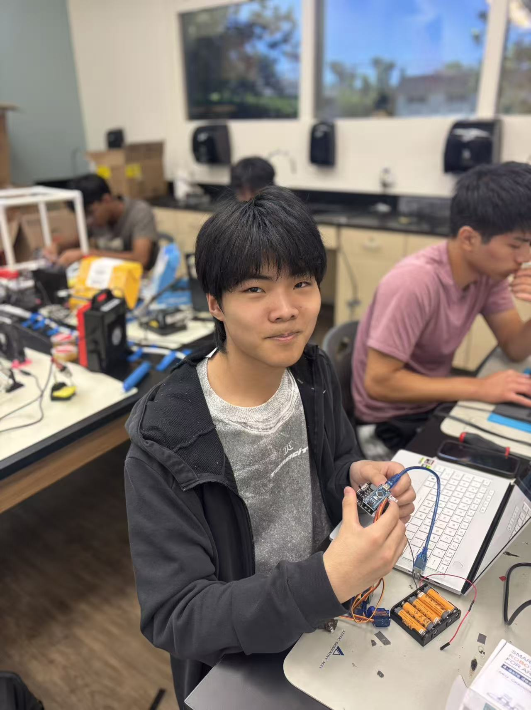

# BlueStamp Browser Controlled Robotic Arm
My project is Browser Controlled Robotic Arm. I write the codes for Arduino IDE and browser to control the robotic arm. There are nine buttons in the browser. One is home button, each of other eight buttons can control different parts of the robotic aram.

| **Engineer** | **School** | **Area of Interest** | **Grade** |
|:--:|:--:|:--:|:--:|
| Nuojie W | Miramonte High school | Not sure | Incoming Senior


  
# Final Milestone

<iframe width="560" height="315" src="https://www.youtube.com/embed/5WRIAu6pgqA?si=2FZCuvYKT6kmjXyA" title="YouTube video player" frameborder="0" allow="accelerometer; autoplay; clipboard-write; encrypted-media; gyroscope; picture-in-picture; web-share" referrerpolicy="strict-origin-when-cross-origin" allowfullscreen></iframe>

Since the second milestone, I have spent a lot of time on finishing the final milestone. First, I test the bluetooth module. I do not change a lot for testing code of bluetooth module. It just need to make that bluetooth module can receive somet commands. So I use PuTTY to test the bluetooth module. After testing bluetooth module, I write the code for browser. I write the flask code and index code. Then, I open the browser successfully. It's a slider controlled browser. There are four sliders. You can move the each slider to contorl each part of the robotic arm. However, I can only click the slider to one position in order to make it move and the robotic arm will move rapidlly. I can not move the slider smoothly because the robotic arm will be shaking. So I have to change the code of Arduino IDE. To make it move smoothly and make it never shaking is the biggest challenge I have faced at Blue Stamp Engineering. I rewrite the whole code for controlling the robotic arm and index again and again. Finally, I finish rewriting the code. I change the slider control into button control, and I can move each part of robotic arm when I hold the butoon. There are nine buttons in the browser. The top button is named home. When you click the home button, all of the servos will back to 90 degrees. Each of other four servos have two buttons which is contorl the servo to move left and right. However, the two buttons of gripper are different. These two buttons is to make gripper open and close. So I just make them move to 90 degrees and 180 degrees. Unfortunatelly, the bluetooth module will be disconnected when I control the robotic arm. There is no light on bluetooth module totally. I try to solve this problem and research it. This is because I use six 1.5V batteries. Moving the servos will cause a large instant current. It will make bluetooth module being disconnected. Then, I change the six 1.5V batteries into five 1.5V batteries. Moreover, I faced a similar problem which is also the bluetooth module will be disconnected. But there are light on bluetooth module which means the bluetooth module is searching state.I download the "ServoTimer2Plus" and change the code "#include <Servo.h>" into "#include <ServoTimer2Plus.h>". The problem is solved. Since I have came into the Blue Stamp Engineering, I not only improve my coding skills, but also improve my problem solving skills. I plan to learn more about coding knowledge and do more about robots.


# Second Milestone

<iframe width="560" height="315" src="https://www.youtube.com/embed/_Dp6k8TR21Q?si=OyAmCXBaJie-dOUs" title="YouTube video player" frameborder="0" allow="accelerometer; autoplay; clipboard-write; encrypted-media; gyroscope; picture-in-picture; web-share" referrerpolicy="strict-origin-when-cross-origin" allowfullscreen></iframe>

Assembling the mechanical parts of arm is not hard, but it still takes me a few times. You can watch video and find that there are four servos. Each servo control different parts of robtic arm. For the controller, you can see there are two joysticks. The right joystick can control the opening and closing of the arm. The left joystick can control the turning of base and the turning of arm. The biggest challenge I faced absolutely is code problems. Because I am not good at coding, so I mainly use the code from the instruction. However, there are some problems by using code from the instruction. In the tutorial code, there was an error in line45.#include "src/CokoinoArm.h" I move the library of the Arduino IDE to the desktop and change the path in the code. Then, I try to verify again. It still repport an error called compilation error exit status 1. I am confused. After that I back to initial code. I open all the files in the library as the notebook. Then, I try to verify and it works. I actually do not know what the problem is. I think it probably is because of not fully loaded. Now, I have assembled the bluetooth module. I will try to test the bluetooth module by using some code in Arduino IDE. However, there is no tutorial code for the future paths. So I need to search them and learn how to code in the future paths. Also, after testing the bluetooth module, the controlling of the turning and moving of the robtic arm are still by four servos.  In the future plan, I will try to control the robtic arm by browser.

# First Milestone

<iframe width="560" height="315" src="https://www.youtube.com/embed/RNaX80Mot9k?si=LezSoxHmxEJH6wmU" title="YouTube video player" frameborder="0" allow="accelerometer; autoplay; clipboard-write; encrypted-media; gyroscope; picture-in-picture; web-share" referrerpolicy="strict-origin-when-cross-origin" allowfullscreen></iframe>

My intensive project is Broswer Controlled Robtic arm. Depending on my plan, my first milestone is to make sure all servos are working. Although I have already assemble the base parts of mechanical parts of the arm, I still can show you about this. First, I need to make sure one servo is working before testing all of them. Luckliy, there are some tested code of one servo in the instruction. So I use them successfully. As showing in the video, you can see there are four servos turning around at the same time. However, I only have the tested code of one servo. Then, I try to change the code by myself. Compared to the tested code. I identity successfully about the ports. In the tested code, the port is number 10. I change it to number4,5,6,7. But I think the speed of turning around is too slow. Unfortunately, I do not know which code is about speed. So I search it. Finally, I change the speed of the turning around successfully.

# Starter Milestone

<iframe width="560" height="315" src="https://www.youtube.com/embed/eAavtL_IkY4?si=-p9Xfx_S2d1FHGH0" title="YouTube video player" frameborder="0" allow="accelerometer; autoplay; clipboard-write; encrypted-media; gyroscope; picture-in-picture; web-share" referrerpolicy="strict-origin-when-cross-origin" allowfullscreen></iframe>

My starter project is LED slider. There are three sliders to control each colors which are red, green and blue. First, I learned how to use the soldering iron. Then, I assembled the mechanical parts of the board. However, there were still many holes. To make sure the system of the LED slider is working, I need to use the soldering iron to melt solder in order to connect with the board. Last, I tested it and controled to make different color successfully.

# Schematics 
Here's where you'll put images of your schematics. [Tinkercad](https://www.tinkercad.com/blog/official-guide-to-tinkercad-circuits) and [Fritzing](https://fritzing.org/learning/) are both great resoruces to create professional schematic diagrams, though BSE recommends Tinkercad becuase it can be done easily and for free in the browser. 

# Code
```c++
#include <ServoTimer2Plus.h>
#include <SoftwareSerial.h>

SoftwareSerial BT(2,3);

ServoTimer2Plus baseServo;
ServoTimer2Plus shoulderServo;
ServoTimer2Plus elbowServo;
ServoTimer2Plus gripperServo;

int baseAngle = 90;
int shoulderAngle = 90;
int elbowAngle = 90;
int gripperAngle = 90;

bool baseLeft = false;
bool baseRight = false;
bool shoulderUp = false;
bool shoulderDown = false;
bool elbowUp = false;
bool elbowDown = false;

String command = "";

void setup()
{
    Serial.begin(9600);
    BT.begin(9600);

    baseServo.attach(4);
    shoulderServo.attach(5);
    elbowServo.attach(6);
    gripperServo.attach(7);

    baseServo.write(baseAngle);
    shoulderServo.write(shoulderAngle);
    elbowServo.write(elbowAngle);
    gripperServo.write(gripperAngle);

    Serial.println("Robot Ready");
    BT.println("Robot Ready");
}

void readBluetooth()
{
    while (BT.available())
    {
        char c = BT.read();

        if (c == '\n')
        {
            command.trim();

            Serial.print("Receive: ");
            Serial.println(command);

          

            if (command == "HOME")
            {
                baseLeft = false;
                baseRight = false;

                shoulderUp = false;
                shoulderDown = false;

                elbowUp = false;
                elbowDown = false;

                baseAngle = 90;
                shoulderAngle = 90;
                elbowAngle = 90;
                gripperAngle = 90;

                baseServo.write(baseAngle);
                shoulderServo.write(shoulderAngle);
                elbowServo.write(elbowAngle);
                gripperServo.write(gripperAngle);
            }

          

            else if (command == "BL")
            {
                baseLeft = true;
                baseRight = false;
            }

            else if (command == "BR")
            {
                baseRight = true;
                baseLeft = false;
            }

            else if (command == "BSTOP")
            {
                baseLeft = false;
                baseRight = false;
            }

          

            else if (command == "SU")
            {
                shoulderUp = true;
                shoulderDown = false;
            }

            else if (command == "SD")
            {
                shoulderDown = true;
                shoulderUp = false;
            }

            else if (command == "SSTOP")
            {
                shoulderUp = false;
                shoulderDown = false;
            }

          

            else if (command == "EU")
            {
                elbowUp = true;
                elbowDown = false;
            }

            else if (command == "ED")
            {
                elbowDown = true;
                elbowUp = false;
            }

            else if (command == "ESTOP")
            {
                elbowUp = false;
                elbowDown = false;
            }

           

            else if (command == "GO")
            {
                gripperAngle = 180;
                gripperServo.write(gripperAngle);
            }

            else if (command == "GC")
            {
                gripperAngle = 90;
                gripperServo.write(gripperAngle);
            }

            command = "";
        }
        else
        {
            command += c;
        }
    }
}

void updateBase()
{
    if (baseLeft && baseAngle > 0)
    {
        baseAngle--;
        baseServo.write(baseAngle);
    }

    if (baseRight && baseAngle < 180)
    {
        baseAngle++;
        baseServo.write(baseAngle);
    }
}

void updateShoulder()
{
    if (shoulderUp && shoulderAngle > 0)
    {
        shoulderAngle--;
        shoulderServo.write(shoulderAngle);
    }

    if (shoulderDown && shoulderAngle < 180)
    {
        shoulderAngle++;
        shoulderServo.write(shoulderAngle);
    }
}

void updateElbow()
{
    if (elbowUp && elbowAngle > 0)
    {
        elbowAngle--;
        elbowServo.write(elbowAngle);
    }

    if (elbowDown && elbowAngle < 180)
    {
        elbowAngle++;
        elbowServo.write(elbowAngle);
    }
}

void loop()
{
    readBluetooth();

    updateBase();

    updateShoulder();

    updateElbow();

    delay(15);
}
```

# Bill of Materials

| **Part** | **Note** | **Price** | **Link** |
|:--:|:--:|:--:|:--:|
| Arduino NANO board | Control the arm | $22.0 | https://store-usa.arduino.cc/collections/nano-family/products/nano-r4-connector-bundle  |
| Smart Robtic Arm For Arduino | Mechanical parts of arm | $46.0 | https://cokoino.com/products/robot-arm-for-arduino  |
| Batteries | Power support | $6.49 | https://www.amazon.com/AmazonBasics-Performance-Alkaline-Batteries-Count/dp/B00O869KJE?th=1  |
| HC-05 bluetooth module | Connection with browser | $10.39 | https://www.amazon.com/HiLetgo-Wireless-Bluetooth-Transceiver-Arduino/dp/B071YJG8DR  |

# Other Resources/Examples
One of the best parts about Github is that you can view how other people set up their own work. Here are some past BSE portfolios that are awesome examples. You can view how they set up their portfolio, and you can view their index.md files to understand how they implemented different portfolio components.
- [Example 1](https://trashytuber.github.io/YimingJiaBlueStamp/)
- [Example 2](https://sviatil0.github.io/Sviatoslav_BSE/)
- [Example 3](https://arneshkumar.github.io/arneshbluestamp/)

To watch the BSE tutorial on how to create a portfolio, click here.
